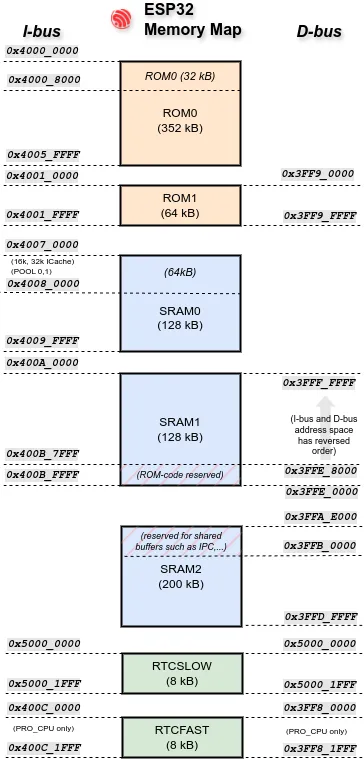

# 内存分配

在 `no_std` 环境中，可以选择使用 [`alloc`][alloc] crate 进行堆分配，从而使用 `Vec`、`Box` 等常用 Rust 类型，以及其他需要堆分配的集合。有时，你希望使用的某个依赖项也可能要求使用 `alloc`。

我们提供了自己的 `no_std` 堆分配器 [`esp-alloc`][esp-alloc]。不过，在启用它之前，你应该先了解**为什么**需要堆分配，以及其中的取舍。

## 为什么不使用堆？

虽然堆分配更加灵活，但它也有一些代价：

- **碎片化**：随着时间推移，动态分配可能导致_碎片化_。即使剩余内存总量足够，零散的小块内存也可能使大块内存无法分配。这可能导致难以察觉的运行时故障。
- **运行时开销**：分配和释放内存需要计算成本，所选分配器本身也可能带来额外开销。

## 可配置的内存布局与回收的 RAM

一些乐鑫芯片的内存映射并不连续，并非所有物理 RAM 都可以作为一个连续的堆使用。例如，某些区域保留给 ROM 代码使用，不能被覆盖。下面以 ESP32 的内存布局为例。

<p align="center">

</p>

此外，二级 bootloader 在启动过程中会使用一部分内存。这部分内存不能用作栈，但在进入主应用程序后可以用作堆。你可以在堆分配器声明中使用 `#[ram(reclaimed)]` 宏，利用这部分原本未被使用的内存。

```rust
// Use 64kB in dram2_seg for the heap, which is otherwise unused.
heap_allocator!(#[ram(reclaimed)] size: 64000);
```

## PSRAM

我们的芯片有几百千字节的内部 RAM，对某些应用来说可能不够。一些乐鑫芯片可以通过虚拟地址访问外部 PSRAM（伪静态 RAM）。在满足某些限制的情况下，外部内存可以像内部数据 RAM 一样使用。

> [!NOTE]
> 在 Xtensa 芯片上，PSRAM 中的原子操作无法正确工作，可能引发数据竞争，从而失去原子操作应有的作用。因此，不能使用该分配器直接或间接地为 `Atomic*` 类型分配内存。ESP32 的相关限制可以在[这里][here]找到。此问题**不影响**我们的 RISC-V 芯片，它们的 PSRAM 能够正确支持原子操作。

### 分配器注意事项

你只能有**一个全局分配器**，但这个分配器可以使用多个内存区域（例如 PSRAM、内部 RAM，或它们的多个内存块）。通过 nightly 的 `allocator_api` 功能和 [`allocator_api2`][allocator api2]，可以使用多个分配器；[`esp-alloc`][esp-alloc] 实现了后者的接口。

[esp-alloc]: https://crates.io/crates/esp-alloc
[alloc]: https://doc.rust-lang.org/alloc/
[here]: https://docs.espressif.com/projects/esp-idf/en/v5.4.1/esp32/api-guides/external-ram.html#restrictions
[allocator api2]: https://crates.io/crates/allocator-api2
