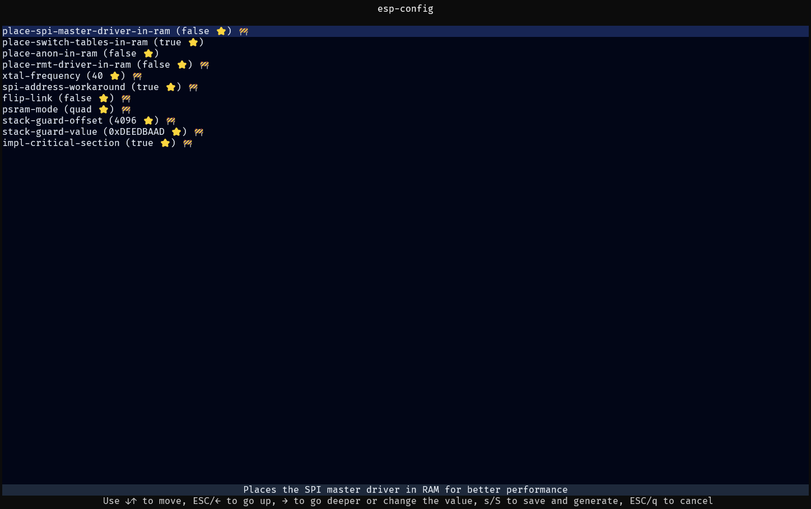

# 使用 `esp-config` 的 TUI（可选）

如果已经安装此工具，可以在项目目录中运行 `esp-config`，启动后的界面如下：

如果工具无法自动识别，你也可以指定目标芯片和要使用的配置文件。

对于通过 `esp-generate` 生成的项目，通常不需要这样做。

有关配置文件的组织方式，以及如何手动编辑它们，请参阅[配置章节](../application-development/configuration.md)。
