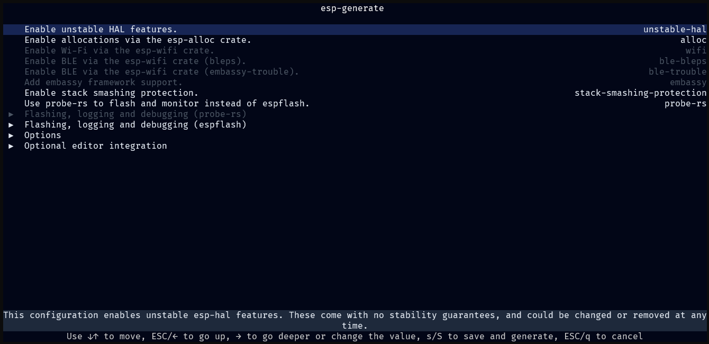

# 使用 `esp-generate`

安装好所有必需的工具后，你就可以创建第一个在乐鑫芯片上运行的 Rust 项目了。

## 生成项目

首先，运行以下命令，启动交互式配置工具：

```shell
esp-generate
```

`esp-generate` 会提示你选择芯片并输入项目名称，然后进入 TUI，通过选项配置项目生成过程。



根据项目需要调整选项。请参阅 README 中的[可用选项][available-options]部分。TUI 底部会显示各选项的简短说明。

[available-options]: https://github.com/esp-rs/esp-generate?tab=readme-ov-file#available-options

## 烧录选项

有两种工具可以将代码烧录到目标设备：

- `espflash`：默认的烧录工具。
- `probe-rs`：启用基于实时传输（RTT）的选项，并支持片上调试。
  - 生成项目时，请确保启用 `Use probe-rs to flash and monitor instead of espflash.`（`probe-rs` 选项）。

> [!TIP]
> 使用 `espflash` 时，可以在 `Flashing, logging and debugging (espflash)` 下启用 `Use the log crate to print messages.` 和 `Use esp-backtrace as the panic handler.`。

> [!TIP]
> 使用 `probe-rs` 而不是 `espflash` 时，可以在 `Flashing, logging and debugging (probe-rs)` 下启用 `Use defmt to print messages.` 和 `Use panic-rtt-target as the panic handler.`。

## 执行项目生成

准备好后，在 TUI 的根界面按下 `s` 即可生成项目。保存项目时，工具会检查必需工具和可选工具是否已安装，并显示结果。根据生成选项，它可能会提示你安装之前遗漏的工具，或现在需要的新工具。

## 运行代码

只需执行以下命令，就能让代码运行起来：

```shell
cargo run --release
```

此命令会编译应用程序，将它烧录到目标设备，并开始监控日志输出。

🎉 恭喜，你已经成功将第一个 Rust 程序烧录到 ESP32 上！

现在，你可以继续深入探索 ESP32 平台上的 Rust 开发。
