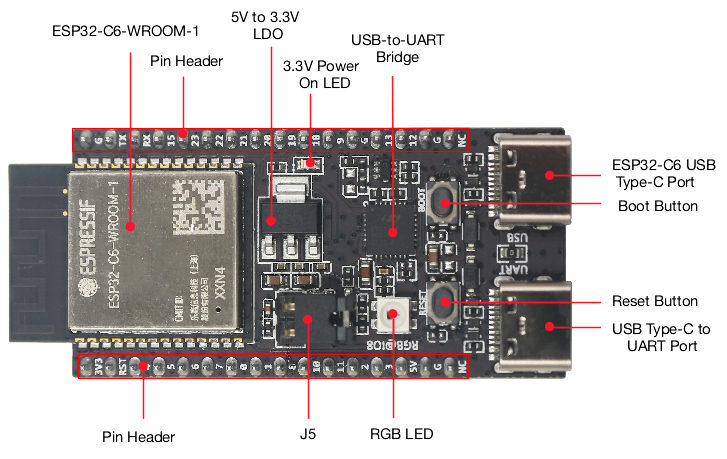

# 硬件概览

`esp-rs` 组织下的 crate 支持 [ESP32、ESP32-S、ESP32-C 和 ESP32-H 系列 SoC][espressif-socs]。

各款 SoC 既有独特的功能，也有一些共同的特性。请使用[乐鑫产品选型工具][product-selector]，为你的项目选择合适的芯片。

乐鑫的产品采用两种不同的系统架构：

- [Xtensa][xtensa-architecture]：ESP32 和 ESP32-S 系列采用 Xtensa 架构。
- [RISC-V][riscv-architecture]：ESP32-C 和 ESP32-H 系列采用 RISC-V 架构。

这里不展开介绍这两种架构的细节或差异。Rust 官方对两者的支持情况不同。Rust 尚未正式支持 Xtensa，原因是 Rust 使用 LLVM 作为编译器基础设施的一部分，而 LLVM 尚不支持 Xtensa。因此，我们维护了 LLVM 和 Rust 编译器的定制分支，加入了对 Xtensa 的支持，并积极推动这些修改合并到上游，以在未来获得官方支持。

> [!NOTE]
> 我们正在积极推动分支中的修改合并到上游。目前的进展如下：
>
> 1. LLVM 分支：最近取得了显著进展。详情请参阅[跟踪 issue][llvm-github-fork-upstream issue]。
> 2. Rust 编译器分支：我们已提交所有可行的 Xtensa 补丁。后续进展取决于这些修改合并到 LLVM 上游的情况。

你可以参阅[技术文档][espressif-docs]，了解不同 SoC 的更多信息。

> [!NOTE]
> `esp-hal` 不支持 ESP8266。
>
> 不过，它支持 ESP32-C2（ESP8684）和 ESP32-C3（ESP8685）。其中，ESP32-C3 与 ESP8266 引脚兼容，可以作为合适的直接替代品。

[espressif-socs]: https://www.espressif.com/en/products/socs
[product-selector]: https://products.espressif.com/#/
[xtensa-architecture]: https://www.cadence.com/content/dam/cadence-www/global/en_US/documents/tools/silicon-solutions/compute-ip/isa-summary.pdf
[riscv-architecture]: https://en.wikipedia.org/wiki/RISC-V
[espressif-docs]: https://www.espressif.com/en/support/documents/technical-documents
[llvm-github-fork-upstream issue]: https://github.com/espressif/llvm-project/issues/4

## 了解乐鑫开发板

以 [ESP32-C6-DevKitC-1][c6-devkitc] 为例。这是一款基于 ESP32-C6 的开发板，包含以下组件：

- ESP32-C6-WROOM-1 模块：
  - 支持 Wi-Fi、BLE 和 IEEE 802.15.4。
  - 8 MB SPI flash。
- 可供使用的 GPIO 引脚。
- 2 个按钮：Boot 和 Reset。
  - Boot 按钮：下载按钮。按住 Boot，再按下 Reset，即可进入固件下载模式，通过串口下载固件。
    - 详情请参阅[启动模式选择][boot-mode-selection]。
  - Reset 按钮：复位设备。
- 2 个 USB-C 接口：
  - USB-C 转 UART 接口：用于给开发板供电、向芯片烧录应用程序，以及通过板载 USB 转 UART 桥接器与 ESP32-C6 芯片通信。
  - USB-C 接口：用于给开发板供电、向芯片烧录应用程序、通过 USB 协议与芯片通信，以及进行 JTAG 调试。
- RGB LED：由 GPIO8 驱动的可寻址 RGB LED。
  - 注意，这不是普通的 RGB LED，而是 [WS2812B LED][esp-hal-smartled]。

[c6-devkitc]: https://docs.espressif.com/projects/esp-dev-kits/en/latest/esp32c6/esp32-c6-devkitc-1/index.html
[boot-mode-selection]: https://docs.espressif.com/projects/esptool/en/latest/esp32c6/advanced-topics/boot-mode-selection.html?highlight=boot%20mode
[esp-hal-smartled]: https://github.com/esp-rs/esp-hal-community/tree/main/esp-hal-smartled
