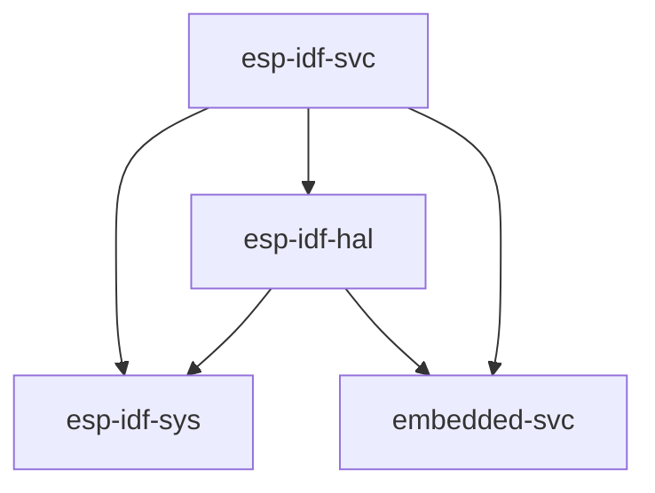

# 使用标准库（`std`）

乐鑫提供了一个基于 C 的开发框架，称为 [ESP-IDF][esp-idf-github]。它支持（或将会支持）所有名称以 ESP32 开头的乐鑫芯片。注意，该框架 _不_ 支持 ESP8266。

ESP-IDF 提供了一个功能强大的 [newlib][newlib-env] 环境，足以在其上构建 Rust 标准库（`std`）。这就是在乐鑫设备上启用 `std` 支持的方法。

[esp-idf-github]: https://github.com/espressif/esp-idf
[newlib-env]: https://sourceware.org/newlib/

## 当前支持情况

只要是 ESP-IDF 框架支持的乐鑫产品，就支持 Rust `std` 开发。有关 ESP-IDF 的不同版本，以及乐鑫芯片支持的详细信息，请参阅[此表格][esp-idf-release-compatibility]。

[esp-idf-release-compatibility]: https://github.com/espressif/esp-idf#esp-idf-release-and-soc-compatibility/

使用 `std` 时，可以访问 [ESP-IDF][esp-idf-github] 中存在的许多功能，包括线程、互斥锁和其他同步原语、集合、随机数生成、套接字等。

### `esp-rs` 相关的 Crate

| 仓库                     | 描述                                                                                                   |
| ------------------------------ | ------------------------------------------------------------------------------------------------------------- |
| [`embedded-svc`][embedded-svc] | 嵌入式服务的抽象 trait（`WiFi`、`Network`、`Httpd`、`Logging`）。                        |
| [`esp-idf-svc`][esp-idf-svc]   | 用 `esp-idf` 驱动实现的 [embedded-svc]。                                                  |
| [`esp-idf-hal`][esp-idf-hal]   | 用 `esp-idf` 框架实现的 `embedded-hal` 和其他 trait。                       |
| [`esp-idf-sys`][esp-idf-sys]   | `esp-idf` 开发框架的 Rust 绑定（binding）。提供了对驱动、Wi-Fi 和其他功能的原始（`unsafe`）访问。 |

上述 crate 的相互依赖关系如下图所示。

[embedded-svc]: https://github.com/esp-rs/embedded-svc
[esp-idf-svc]: https://github.com/esp-rs/esp-idf-svc
[esp-idf-sys]: https://github.com/esp-rs/esp-idf-sys
[esp-idf-hal]: https://github.com/esp-rs/esp-idf-hal

### 何时适合使用标准库（`std`）

- 丰富的功能：如果你的嵌入式系统需要大量功能，例如支持网络协议、文件 I/O 或复杂的数据结构，使用宿主环境（hosted-environment）会是一个较好的方法。因为 `std` 库提供了丰富的功能，便于构建复杂的应用程序。
- 可移植性：`std` crate 提供了一组标准化的 API，可以跨不同平台和架构使用，使你能够更轻松地编写可移植和可重用的代码。
- 快速开发：`std` crate 提供了一组丰富的功能，可用于快速高效地构建应用程序，而无需过多担心底层细节。

